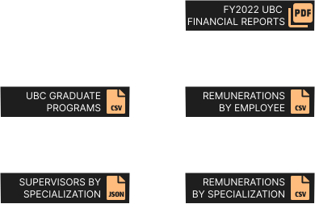

# FY22 UBC Financial Statement

This repo explores the distribution of UBC employee remunerations.

The University of British Columbia (UBC) releases financial statements each year reflecting the assets, liabilities, revenues and expenses of UBC within a fiscal year. UBC also provides unaudited supplemental information about the remunerations of UBC employees that earn greater than 75,000 CAD.

The financial reports can be found here: <https://finance.ubc.ca/reporting-planning-analysis/financial-reports>

The data itself is not stored in this repo, and will have to be downloaded from the above link. The code mapping the PDF tables into tibbles is provided [here](https://github.com/awakenedhaki/ubc-financial-statement-2022/blob/master/R/cleaning.R).

At a high-level, the data collection and preprocessing pipeline is:

